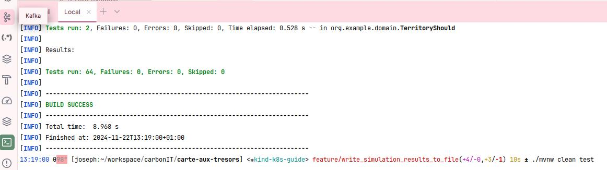
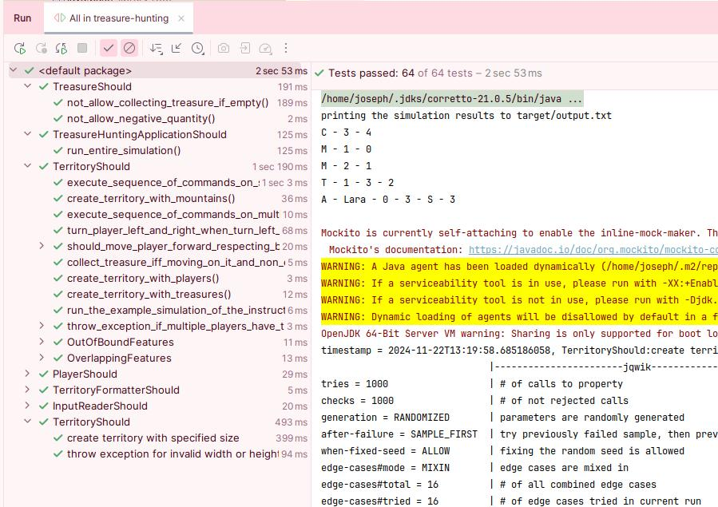

# Exercice pratique - La carte aux trésors

Résolution de l'exercice tel que défini dans la consigne.

## Pré-requis

- Java 21
- (optionnel) Maven (ou utiliser maven wrapper `./mvnw`)

## Exécution des tests

`mvn clean test` or `./mvnw clean test`

Les tests devraient être vert et vous devriez obtenir la sortie suivante:

Vous pouvez aussi les exécuter via l'IDE. Voici un exemple de sortie:

